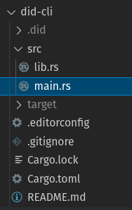
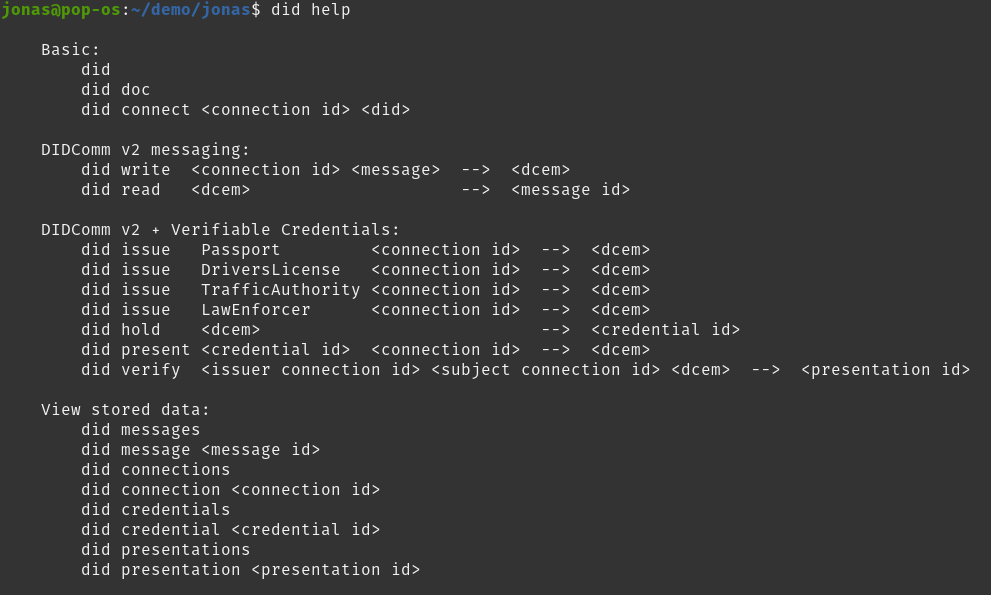

# 5. Implementation

## 5.1 did-cli

- did-cli is the name of the rust-project, where the implementation was developed.
- The rust-project is hosted here https://github.com/DIN-Foundation/bcs-ntnu-2021/tree/main/did-cli.

## 5.2 Code organization

The implementation is following the "guidelines for binary projects", given by the Rust-book, quoted in full below:
>### Separation of Concerns for Binary Projects
>
>The organizational problem of allocating responsibility for multiple tasks to the main function is common to many binary projects. As a result, the Rust community has developed a process to use as a guideline for splitting the separate concerns of a binary program when main starts getting large. The process has the following steps:
>
>* Split your program into a main.rs and a lib.rs and move your program’s logic to lib.rs.
>* As long as your command line parsing logic is small, it can remain in main.rs.
>* When the command line parsing logic starts getting complicated, extract it from main.rs and move it to lib.rs.
>
>The responsibilities that remain in the main function after this process should be limited to the following:
>
>* Calling the command line parsing logic with the argument values
>* Setting up any other configuration
>* Calling a run function in lib.rs
>* Handling the error if run returns an error
>
>This pattern is about separating concerns: main.rs handles running the program, and lib.rs handles all the logic of the task at hand. Because you can’t test the main function directly, this structure lets you test all of your program’s logic by moving it into functions in lib.rs. The only code that remains in main.rs will be small enough to verify its correctness by reading it. Let’s rework our program by following this process.

Ref: https://doc.rust-lang.org/book/ch12-03-improving-error-handling-and-modularity.html#separation-of-concerns-for-binary-projects

Here is a screenshot of the file-structure, which follows from the guidelines:

## 5.3 The Command line interface

- Each command follows the same pattern `did <command> <...args>`.

### Intentional limitations of the CLI

- None of the commands have any optional-arguments - e.g `--option=<arg>`. This is to keep program logic as simple as possible. If the CLI was intended for a broader audicene with multiple use-cases, options may be added. This CLI is a special purpose CLI, intended to solve a specific use-case, namely the specific proof-of-concept from the problem statement. This is why optional-arguments was not prioritized.
- Options are much harder to parse correctly than fixed size positional arguments.
- None of the commands required variable length arguments, which made the implementation easier.
- None of the commands have filepath arguments. The user is expected to use `cat <filepath>` to read the contents of a file, which is then fed into a positional argument of one of the commands. Example: `did read $(cat ../message.dcem)` vs `did read ../message.dcem`. This was done to simplify implementation.
- None of the commands support pipes. This could have been useful as an alternative to the example from the previous point. Example: `cat ../message.dcem | did read`. Since positional arguments + `cat` already solves the problem of reading from file, support for pipes was not prioritized.

## 5.4 Usage of existing Rust libraries

### decentralized-identity/didcomm-rs

- github.com: https://github.com/decentralized-identity/didcomm-rs
- crates.io: https://crates.io/crates/didcomm-rs
- docs.rs: https://docs.rs/didcomm-rs/0.2.4/didcomm_rs/

### spruceid/didkit

- github.com: https://github.com/spruceid/didkit
- docs: https://spruceid.dev/docs/didkit/

### trinsic-id/did-key.rs

- github.com: https://github.com/trinsic-id/did-key.rs
- crates.io: https://crates.io/crates/did-key
- docs.rs: https://docs.rs/did-key/0.0.11/did_key/

### dalek-cryptography/ed25519-dalek

- github.com: https://github.com/dalek-cryptography/ed25519-dalek
- docs.rs: https://docs.rs/ed25519-dalek/1.0.1/ed25519_dalek/
- crates.io: https://crates.io/crates/ed25519-dalek

### dalek-cryptography/x25519-dalek

- github.com: https://github.com/dalek-cryptography/x25519-dalek
- docs.rs: https://docs.rs/x25519-dalek/1.1.0/x25519_dalek/
- crates.io: https://crates.io/crates/x25519-dalek

>@marni: Implementation - WHAT you have done, and how you have done it...
