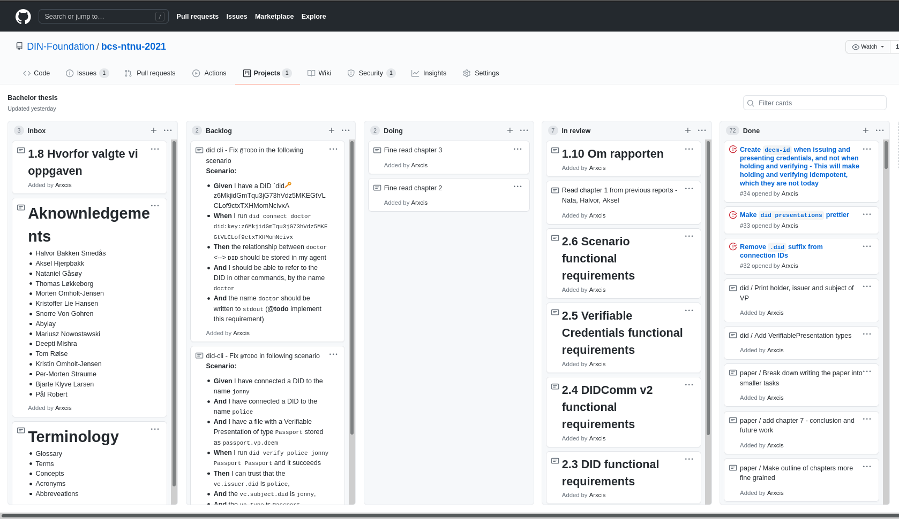
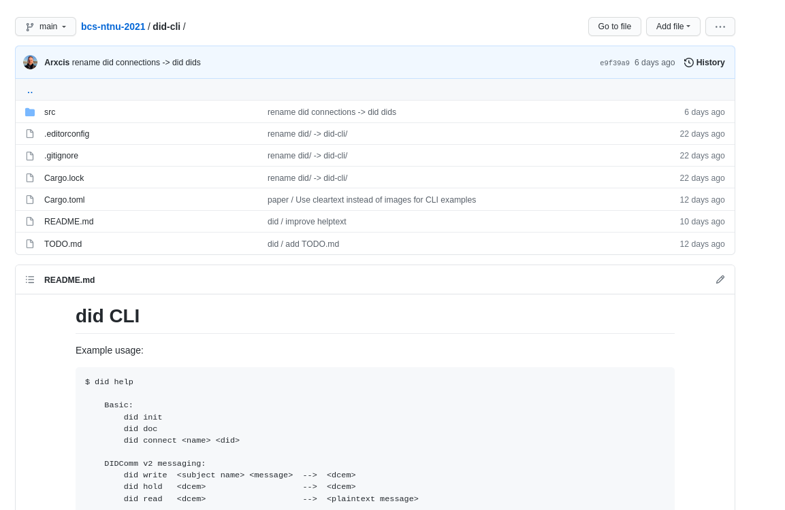
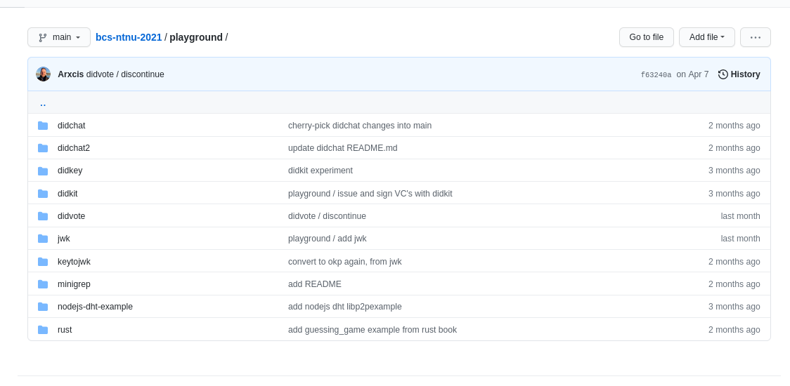
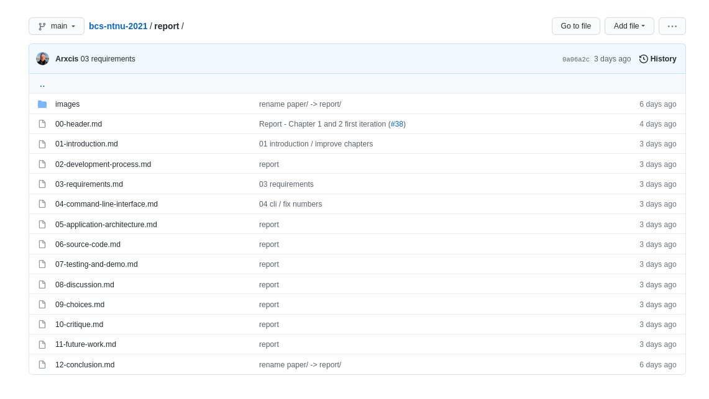
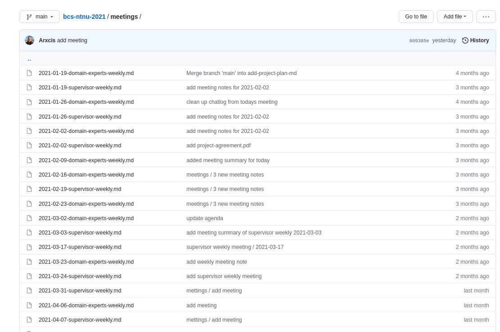
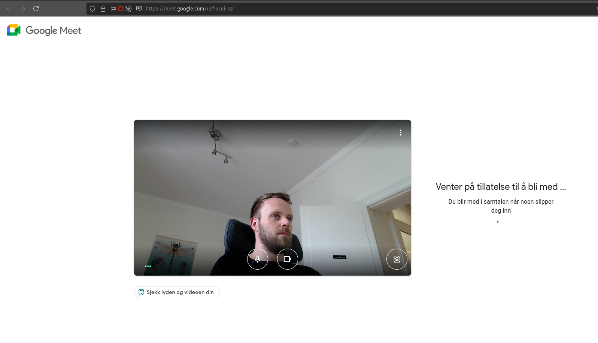
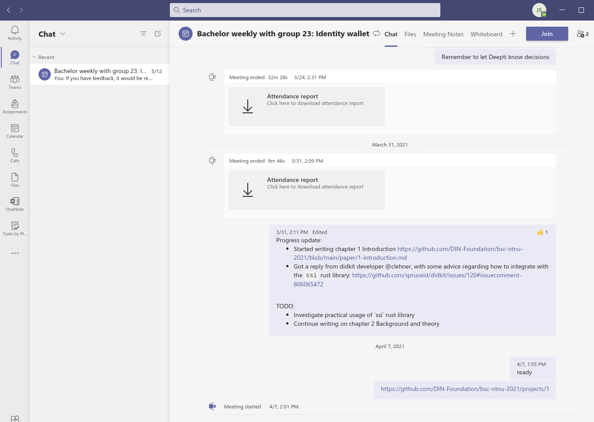
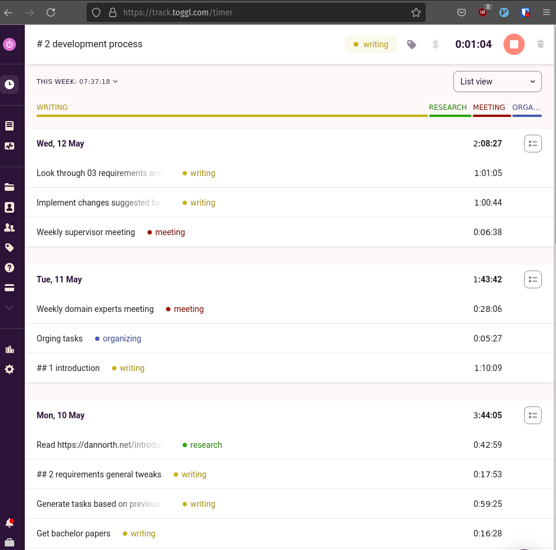
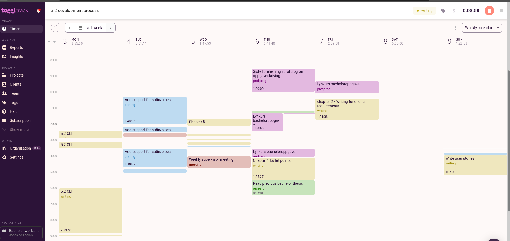
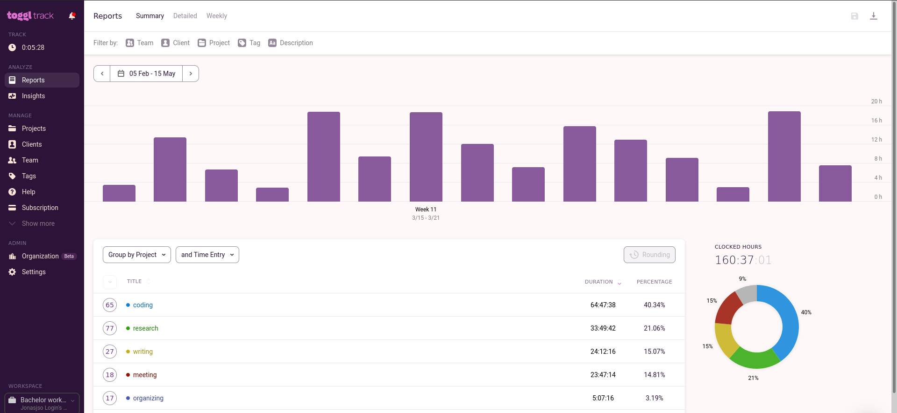

# 2 Development Process

## 2.1 Kanban

The project was losely driven forward by the Kanban framework. To keep track of progress in a Kanban project the Kanban board is essential.

*Kanban board on Github. See: https://github.com/DIN-Foundation/bcs-ntnu-2021/projects/1*

### 2.1.1 The 5 columns on the Kanban board

**1. Inbox**

List of tasks which have been thought of, but is lacking details like what needs to be done and when the implementation is supposed to happen.

Tasks in backlog are created whenever someone feels like it. There are no requirements to put something in the backlog. The treshold should be as low as possible. Eqaully, the treshold for deleting a backlog-task should be equally low.

**2. Backlog**

List of tasks that are planned to be implemented in the near future, and have enough details ironed out to make it possible to start the implementation.

Tasks are moved from `Inbox` to `Todo`:
- After being discussed in the weekly domain-experts meeting.
- **or** after an ad-hoc meeting dedicated to discussing a specific task.
- **or** after the developer has researched/learned something which makes a task "obviously implementable". If a developer does this, it should be clearly communicated in the next weekly domain-experts meeting.

**3. In Progress**

List of tasks that are in progress. A developer have written words, code or done something else. These tasks should ideally be linked to an open Pull Request on Github with a WIP label on it.

**4. In Review**

List of tasks where the developer has implemented the task, and is waiting to get a stamp of approval from a second pair of eyes. Approval could be given by the client, supervisor or any of the domain experts. The developer will request review from the specific person which is considered best suited to review the pull request. This specific person will be notified about this on Discord, and via email if necessary.

**5. Done**

List of task where the pull request linked to the task has been approved and merged into the main branch of the git source tree.

## 2.2 Github source control

All source code was kept in a public open-source Github-repo, during the entire development. This made it easier to collaborate on the source code, because all participants had public access to all the work that was being done, from day one. 

### 2.2.1 DID-CLI source code

*Screenshot of source code folder on Github. See: https://github.com/DIN-Foundation/bcs-ntnu-2021/tree/main/did-cli*

### 2.2.2 Playground mini-projects source code

Before implementing the DID-CLI, a lot of experimentation had to be done. This was done to learn, and iterate on smaller projects, before beginning on the big one. Most of the projects in the playground-folder are useless, but they served an important role as learning exercises.

*Screenshot of the Playground folder on Github. See: https://github.com/DIN-Foundation/bcs-ntnu-2021/tree/main/playground*

### 2.2.3 Report markdown source

Even the report was developed on Github, in the same repo as the source code.

*Screenshot of the Report folder on Github. See: https://github.com/DIN-Foundation/bcs-ntnu-2021/tree/main/report*

## 2.3 Weekly meetings
 
### 2.3.1 Meeting notes on Github

Each meeting has a meeting note document attached to it, noting down the attendees 
and a log of what was discussed during the meeting.

*Screenshot of Meeting notes folder on Github. See: https://github.com/DIN-Foundation/bcs-ntnu-2021/tree/main/meetings*

### 2.3.2  Domain experts Weekly - Tuesdays @ 12:30 

- **Agenda**: Everything related to the problem domain - SSI. Technincal questions. Engineering questions. Community questions. 
- **Attendees:** Jonas, Snorre, Mariusz, Abylay

*Screenshot of Jonas preparing for "Domain Experts Weekly"-meeting on Google Meet:*
	

### 2.3.3 Academic supervisor weekly - Wednesdays @ 14:00

- **Agenda:** Everything related to academic writing and organizing the bachelor in general.
 - **Attendees:** Jonas, Deepti

*Screenshot of the "Academic supervisor weekly"-meeting-room on MSTeams:*
	

## 2.4 Toggl Time Tracking

Tracking the hours was done in Toggl from day 1 (week 5), and throughout the project (end week 20). The hours were tagged with the following 6 categories:

- **Meeting** - Toggled when participating in a live meeting, or when writing meeting notes.
- **Organizing** - Toggled when organizing meetings and creating and updating Kanban tasks.
- **Writing** - Toggled when writing the  bachelor report.
- **Coding** - Toggled when coding in the playground mini-projects, or the DID-CLI main project.
- **Researching** - Toggled when reading specifications, papers, blog-posts, discussing with experts on the DIF and DIN slack/Discord channels, watching videos, reading previous bachelor reports, reading books, and more...
- **Lecture** - Toggled when participating in weekly lectures in the profprog-course, or one of the "lightning lectures" related to the bachelor-course.

*Example of toggl list view:*
	

*Example of toggl calendar view:*

*Example of toggl report from week 5 - 19:*

