## 4  Command Line Interface

- The main way to interact with `did` executeable, is through it's CLI.
- Each command follows the same pattern `did <command> <...args>`.
- The DID-CLI draws inspiration from the book `The Unix Programming environment` by `Brian W. Kernighan` and `Rob Pike`, 1984.


### 4.1 Unix Pipelines Integration

Many of the commands in the DID-CLI, is designed in a way to easily integrate with existing Unix tools. The most important part of this integration, is to support optionally reading input from `stdin`. Also it is important to take care in how output is written to `stdout`, to make it possible to chain commands together. This is the reason you will see that most of commands are standardized to write full DCEM-messages to `stdout`, for easy consumption by the next command in the pipeline.

*Example:*
```
cat message.dcem | did read | grep jonas 
```


### 4.2 Commands

#### `did help`

- List all available commands.

- **Example:**

    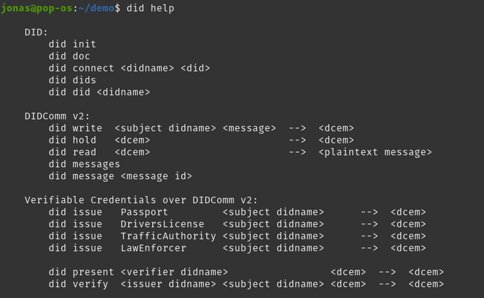

#### `did init`

- Initializes a did-agent in the working directory.
- Run this command before running any other commands.
- The command creates a new `.did/`-directory, inside your working directory.
- A secret/private key is stored inside `.did/`.
- All your agents wallet-data will be stored inside `.did/`.
- Your agents `did` will be returned to `stdout` when running this command.
- If a `.did/` already exists, this commands has no side-effects - the command is idempotent.
- `did init` is intentionally almost identical to `git init`, to make it easier for new users to understand the CLI by reusing a good design-pattern from a well-known CLI like `git`-CLI.

- **Example**:

    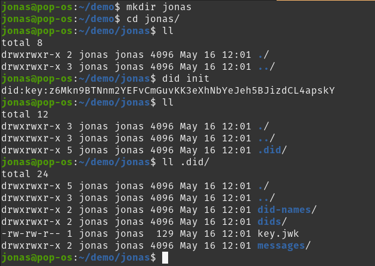


#### `did doc`

- Prints the did-document, controlled by the did agent.
- Since the did-agent uses did-key as it's underlying did-method, the did-document is generated from the public-private keypair.
- Another way to describe this is that did-key is self-resolving - the did-document is resolved directly from the did.
- This is a limitation of the did-key method, and how it is specified.
- Once created, the did-document pinned to a did-key did, is not possible to edit.

- **Example**:

    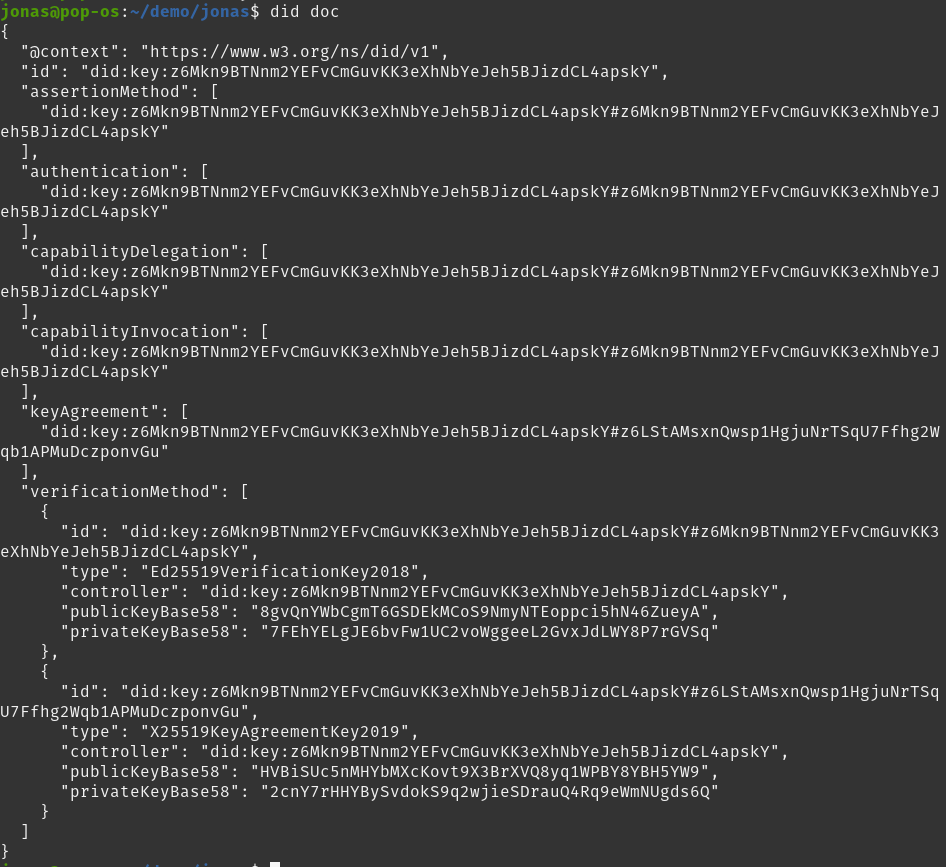


#### `did dids`

- List all dids stored in the agent.
- Dids are added to the agent when running the `did connect` command.

- **Example:**

    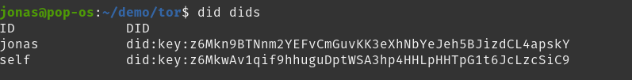

#### `did did <didname>`

- Show the did of a single `<didname>`.

- **Example:**

    


#### `did connect <didname> <did>`

- `did connect` connects a `<didname>` to `<did>`
- `did connect` gives a `<did>` a `<didname>`.
- The `<didname>` is used in other commands, as an easy way to refer to another agent's `<did>`.

- **Example**:

    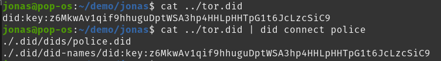

#### `did write <didname> <message>`

- Wraps a user defined message inside a `<dcem>`-envelope.
- Sets the `to`-header of the `<dcem>` to the underlying `<did>` refered to by the `<didname>`.
- Gives the message a new globally unique `id`.

- **Example**:

    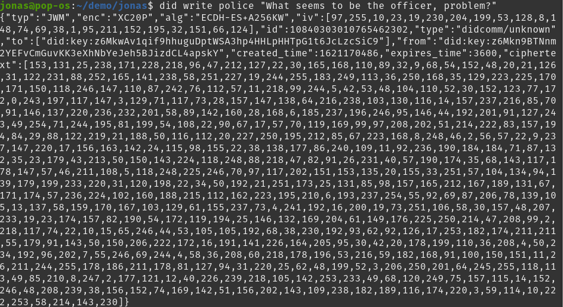

    

#### `did read <dcem>`

- Unwraps an `<dcem>` message from `stdin` or from `<dcem>`-arg.
- Prints the plaintext body of the message.

- **Example**:

    

    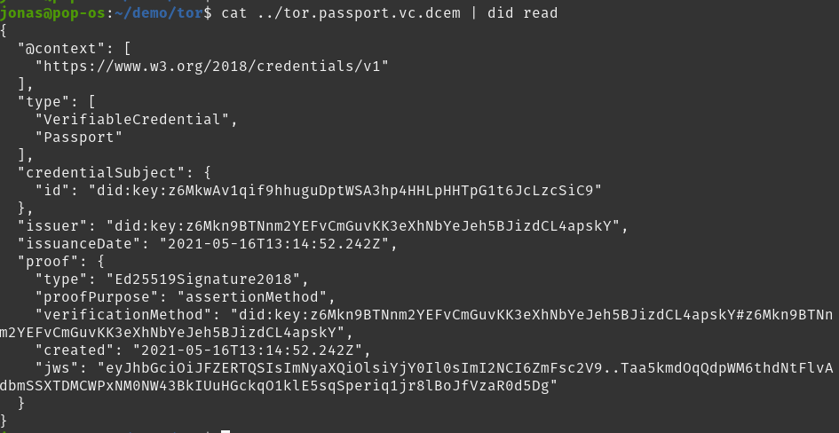

    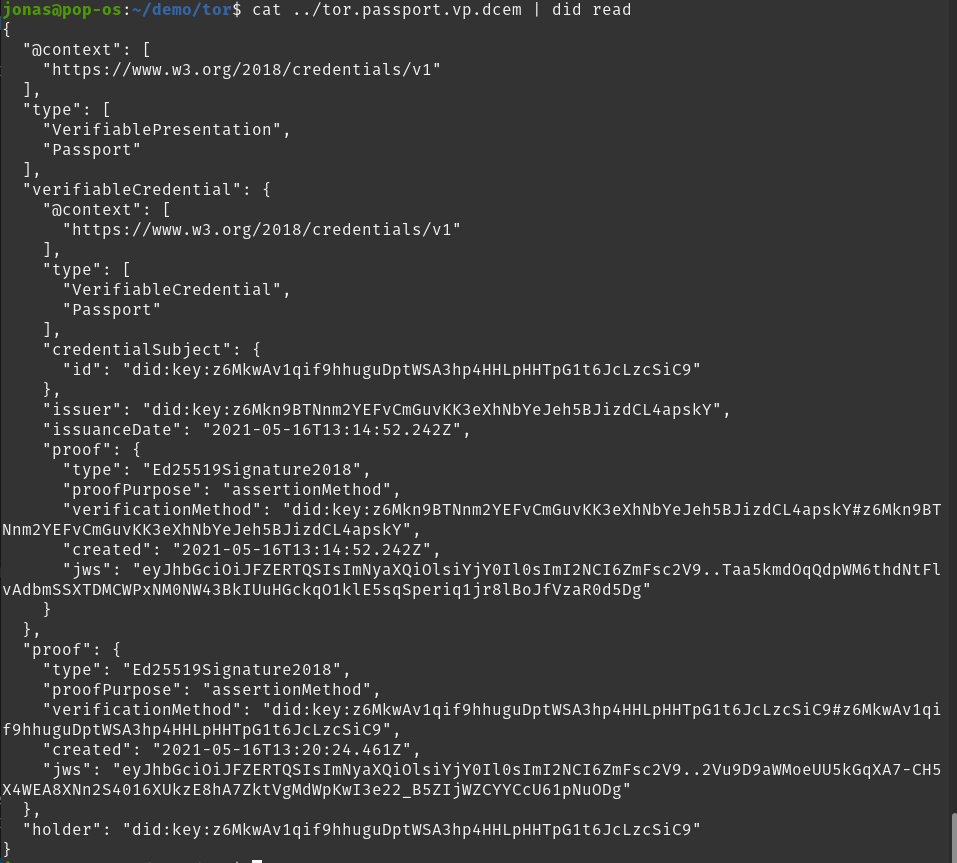


#### `did issue <CredentialType> <didname>`

- Issues a verifiable credential addressed to the `did` of `<didname>`:
- Issues one of 4 `<CredentialType>`s
    * Passport
    * DriversLicense
    * TrafficAuthority
    * LawEnforcer

- **Example**:

    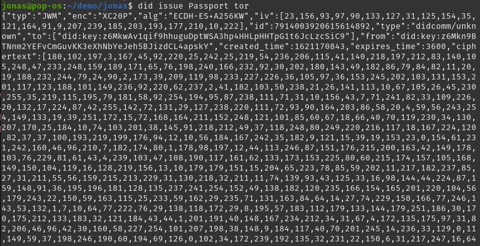

    


#### `did hold <dcem>`

- **Example:**

    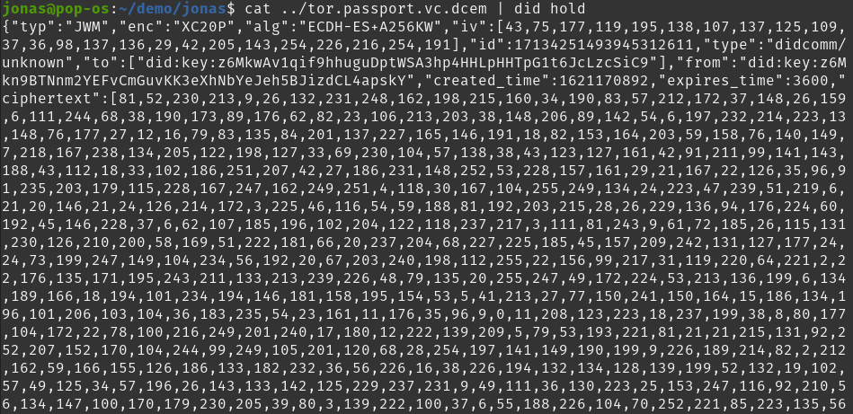

#### `did present <didname> <dcem>`

- **Example:**

    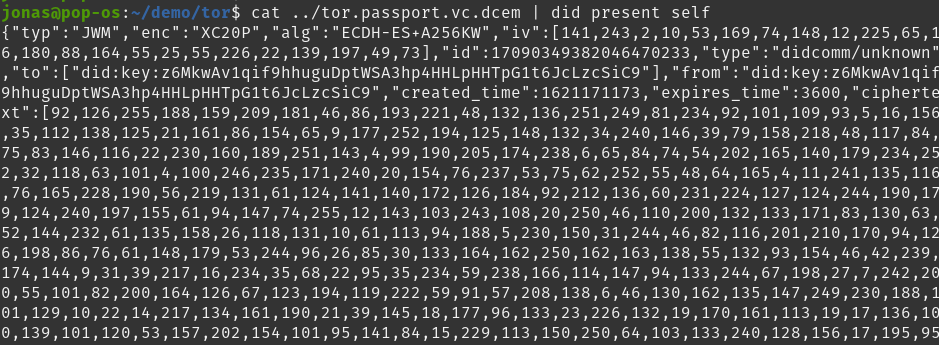

    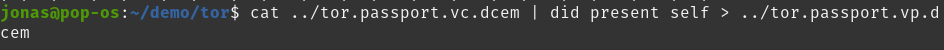

#### `did verify <issuer didname> <subject didname> <dcem>`

- Print `<dcem>` to `stdout`, if, and only if, verification succeeds.

- **Example:**

    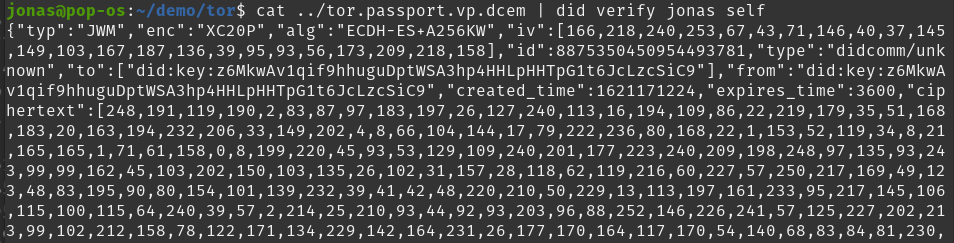

    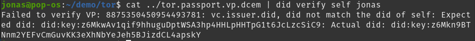

    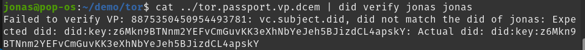

#### `did messages`

- List all didcomm messages stored in the wallet.
- Messages are added to the wallet when using the `did hold` command.

- **Example:**

    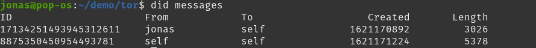

#### `did message <message id>`

- Show the contents of a single didcomm message based on the given `<message id>`.

- **Example:**

    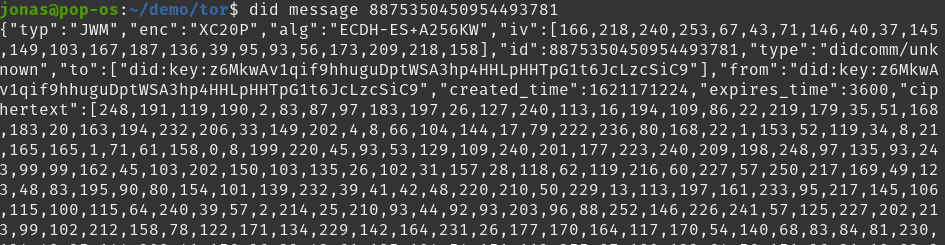


### 4.3 Intentional limitations of the CLI

- None of the commands have any optional-arguments - e.g `--option=<arg>`. This is to keep program logic as simple as possible. If the CLI was intended for a broader audicene with multiple use-cases, options may be added. This CLI is a special purpose CLI, intended to solve a specific use-case, namely the specific proof-of-concept from the problem statement. This is why optional-arguments was not prioritized.
- Options are much harder to parse correctly than fixed size positional arguments.
- None of the commands required variable length arguments, which made the implementation easier.
- None of the commands have filepath arguments. The user is expected to use `cat <filepath>` to read the contents of a file, which is then fed into a positional argument of one of the commands. Example: `did read $(cat ../message.dcem)` vs `did read ../message.dcem`. This was done to simplify implementation.
