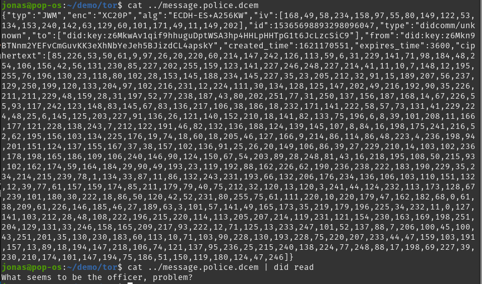

## 4 The CLI - Command Line Interface

- The main way to interact with the `did` executeable, is through it's CLI.
- The `did`'s CLI follows principles laid out in the book `The Unix Programming environment` by `Brian W. Kernighan` and `Rob Pike`, 1984.
- Each command follows the same pattern `did <command> <...args>`.

### 4.1 Command: `did help`

- List all available commands.

- **Example:**

    

### 4.2 Command: `did init`

- Initializes a did-agent in the working directory.
- Run this command before running any other commands.
- The command creates a new `.did/`-directory, inside your working directory.
- A secret/private key is stored inside `.did/`.
- All your agents wallet-data will be stored inside `.did/`.
- Your agents `did` will be returned to `stdout` when running this command.
- If a `.did/` already exists, this commands has no side-effects - the command is idempotent.
- `did init` is intentionally almost identical to `git init`, to make it easier for new users to understand the CLI by reusing a good design-pattern from a well-known CLI like `git`-CLI.

- **Example**:

    


### 4.3 Command: `did doc`

- Prints the did-document, controlled by the did agent.
- Since the did-agent uses did-key as it's underlying did-method, the did-document is generated from the public-private keypair.
- Another way to describe this is that did-key is self-resolving - the did-document is resolved directly from the did.
- This is a limitation of the did-key method, and how it is specified.
- Once created, the did-document pinned to a did-key did, is not possible to edit.

- **Example**:

    


### 4.4 Command: `did connect <name> <did>`

- `did connect` connects a `<name>` to `<did>`
- `did connect` gives a `<did>` a `<name>`.
- The `<name>` is used in other commands, as an easy way to refer to another agent's `<did>`.

- **Example**:

    

### 4.5 Command: `did write <name> <message>`

- Wraps a user defined message inside a `<dcem>`-envelope.
- Sets the `to`-header of the `<dcem>` to the underlying `<did>` refered to by the `<name>`.
- `did write` also stores the `<dcem>`-message in the agent's wallet message history.
- Gives the message a new globally unique `id`.

- **Example**:

    

### 4.6 Command: `did read <dcem>`

- Unwraps an incomming `<dcem>` message.
- Stores the message in the agent's wallet message history.
- Returns the `id`, of the `<dcem>`'s `id`-header. This `id` may be used to read the contents of the message using `did message <message id>`

- **Example**:

    

### 4.7 Command: `did issue <CredentialType> <connection id>`

- Issues a verifiable credential addressed to the `did` of `<connection id>`:
- Issues one of 4 `<CredentialType>`s
    * Passport
    * DriversLicense
    * TrafficAuthority
    * LawEnforcer

**Example**:
	```shell
	$ did issue Passport tor
	{"typ":"JWM","enc":"XC20P","alg":"ECDH-ES+A256KW","iv":[245,193,71,215,42,199,187,139,24,252,177,47,67,183,44,194,54,135,53,178,42,20,101,226],"id":14914780140536880416,"type":"didcomm/unknown","to":["did:key:z6MkfPkLRLftwqUSjxPgJHiTAoSLE6WcBoeWMZJ2KD3j6CoM"],"from":"did:key:z6Mkt8M2q23yEZHqo8CGbngpTKBDvdf3EazphaJRqNP3kXft","created_time":1620060256,"expires_time":3600,"ciphertext":[....216,34,58,164,150]}
	```

	```shell
	$ did issue Passport tor > ../tor.passport.vc.dcem
	```

### 4.8 Command: `did hold <dcem>`

### 4.9 Command: `did present <credential id> <connection id>`

### 4.10 Command: `did verify <issuer connection id> <subject connection id> <dcem>`

### 4.11 Command: `did messages`

- List all didcomm messages stored in the wallet.
- Messages are added to the wallet when using the `did write` and `did read` commands.

### 4.12 Command: `did message <message id>`

- Show the contents of a single didcomm message based on the given `<message id>`.

### 4.13 Command: `did connections`

- List all did connections stored in the wallet.
- Connections are added to the wallet when using the `did connect` command.

### 4.14 Command: `did connection <connection id>`

- Show the did of a single did connection based on `<connection id>`.

### 4.15 Intentional limitations of the CLI

- None of the commands have any optional-arguments - e.g `--option=<arg>`. This is to keep program logic as simple as possible. If the CLI was intended for a broader audicene with multiple use-cases, options may be added. This CLI is a special purpose CLI, intended to solve a specific use-case, namely the specific proof-of-concept from the problem statement. This is why optional-arguments was not prioritized.
- Options are much harder to parse correctly than fixed size positional arguments.
- None of the commands required variable length arguments, which made the implementation easier.
- None of the commands have filepath arguments. The user is expected to use `cat <filepath>` to read the contents of a file, which is then fed into a positional argument of one of the commands. Example: `did read $(cat ../message.dcem)` vs `did read ../message.dcem`. This was done to simplify implementation.
- None of the commands support pipes. This could have been useful as an alternative to the example from the previous point. Example: `cat ../message.dcem | did read`. Since positional arguments + `cat` already solves the problem of reading from file, support for pipes was not prioritized.
