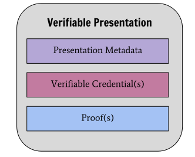

# 5 Application Architecture


## 5.1 Data Model

@Screenshot

### 5.1.1 DID, DID Document and DID-methods

- A DID is the unique identifier of an agent.
- DID's can resolve to a DID Document.
- The DID-method decides the details on how to resolve the DID-document.
- DID data model -> https://www.w3.org/TR/did-core/#data-model

### 5.1.2 DIDKey method

DIDKey is the only DID-method we are supporting.

DID method key format -> https://w3c-ccg.github.io/did-method-key/#format

### 5.1.3 ed25519-JWK

The JWK DID-CLI is supporting, is a `ed25519/x25519` cryptographic public-private keypair, underpinning the DIDKey-method. The `jwk` is used for many things:
- Each unique `jwk` maps to a unique DID in the DIDKey-method.
- By holding the `jwk`, the agent is able to assert control over it's DID in the DIDKey-method.
- The `jwk` is used to encrypt DIDComm messages.
- The `jwk` is used when generating the shared key in the Elliptic-Curve-Diffie-Helmann-key-exchange (ECDH-protocol).
- The `jwk` is used to sign Verifiable Credentials and Verifiable Presentations.

*Example of an ed25519-jwk used by DID-CLI*
```json
{
	"kty":"OKP",
	"crv":"Ed25519",
	"x":"YRJAoEuAzcdc_7QdEM0NHQCd6hd-FdHkpdXl8T-RlVA",
	"d":"HOrwgKInYvPw_Wh6nN6kTNEd3wkkwYySMSuXzdr5Gec"
}
```

JWK format -> https://datatracker.ietf.org/doc/html/rfc7517#section-4.1

### 5.1.4 DCEM - DIDComm Encrypted Message

All messages read and written by the agent, are serialized as DIDComm Encrypted Messages, both in transit, and when at stored at rest inside the agent, as files.

DCEM spec -> https://identity.foundation/didcomm-messaging/spec/#didcomm-encrypted-message

### 5.1.5 Verifiable Credentials

All credentials issued by the agent are serialized as Verifiable Credentials.


VC data model -> https://www.w3.org/TR/vc-data-model/#credentials

### 5.1.6 Verifiable Presentations

All presentations of Verifiable Credentials are serialized as Verifiable Presentations.



VP data model -> https://www.w3.org/TR/vc-data-model/#presentations

### 5.1.7 DIDName

- DIDName is a way of refering to a DID in a local DID-CLI command, because it is impossible to remember the full DID.
- DIDName is the only part of DID-CLI's data-model which is not part of an SSI-standard.
- Each DIDName is stored as a file `<DIDName>.did`, and the full DID as the content.
- Example: `self.did` or `jonas.did`.


## 5.2 File Storage

### 5.2.x The `.did/` directory

All the agents files are contained within the `.did/`-directory, created when initializing the agent. The DID-CLI will use whatever `.did/`-directory is inside the current terminal working directory, just like GIT-CLI uses the `.git/`-directory.

### 5.2.x Portability

The agent database, represented by the `.did/` directory, should be portable. A user should be able to move it to any other location on local machine, or to any other machine, and the agent should still work.


### 5.2.x One directory per agent

```

for i in bob lisa snorre jonas
do
	mkdir $i;
	cd $i;
	did init;
	cd ..;
done
```

### 5.2.x Communicating by sharing files

```
mkdir bob/ lisa/
cd bob/
did init
did did self > ../bob.did

cd ../lisa
did init
did did self > ../lisa.did

cd ../lisa
cat ../bob.did | did connect bob
cd ../bob
cat ../lisa.did | did connect lisa
```


## 5.3 High-level solution to scenario


### 5.3.1 The Government Issues credentials to it's citizens


1. **Issue** - The Government-agent issues 3 passport as Verifiable Credentials, to the 3 different citizen-agents - Jonas, Snorre and Abylay.
2. **Hold** - The 3 citizen agents each hold the one passport issued to them.


3. **Issue** - The Govenment-agent issues a Traffic Authority and a Law Enforcer credential, to two different agents. This, in practice, creates the "Vegvesen" and the Police.
4. **Hold** - The "Vegvesen"-agent and the Police-agent holds their respective credentials issued to them.


### 5.3.2 Jonas gets a Drivers License from Vegvesen


1. **Present** - Vegvesen presents it's "Traffic Authority"-credential to Jonas,.
2.  **Verify** - Jonas verifies that the presentation has a valid signature, and makes sure that the "Traffic Authority"-credential was signed by the Government.
3. **Present** - Jonas presents his "Passport"-credential to Vegvesen.
4. **Verify** - Vegvesen verifies that the presentation is valid, and makes sure the passport credential was signed by the Government.
5. **Proove** - Jonas somehow proves to Vegvesen that he know how to drive a car. This is out of scope of any of the SSI-protocols.
6. **Issue** - Vegvesen issues a Drivers License as a Verifiable Credential to Jonas.
7.  **Hold** - Jonas holds the Drivers License issued to him.

### 5.3.3 Jonas presents his Drivers License to Police


1. **Present** - Police presents it's "Law Enforcer"-credential to Jonas.
2. **Verify** - Jonas verifies that the presentation has a valid signature, and makes sure that the "Traffic Authority"-credential is issued by the Government.
3. **Present** - Jonas presents it's Passport-credential to the Police.
4. **Verify** - Police verifies that the presentation has a valid signature, and makes sure that the Passport-credential is issued by the Government.
5. **Present** - Finally Jonas presents his Drivers License.
6. **Verify** - Police verifies that the Drivers License is valid, and issued by the Government.
