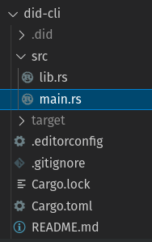

# 6 Source code

## 6.1 Code organization

The source code is following the "guidelines for binary projects", given by the Rust-book, quoted in full below:

>### Separation of Concerns for Binary Projects
>
>The organizational problem of allocating responsibility for multiple tasks to the main function is common to many binary projects. As a result, the Rust community has developed a process to use as a guideline for splitting the separate concerns of a binary program when main starts getting large. The process has the following steps:
>
>* Split your program into a main.rs and a lib.rs and move your program’s logic to lib.rs.
>* As long as your command line parsing logic is small, it can remain in main.rs.
>* When the command line parsing logic starts getting complicated, extract it from main.rs and move it to lib.rs.
>
>The responsibilities that remain in the main function after this process should be limited to the following:
>
>* Calling the command line parsing logic with the argument values
>* Setting up any other configuration
>* Calling a run function in lib.rs
>* Handling the error if run returns an error
>
>This pattern is about separating concerns: main.rs handles running the program, and lib.rs handles all the logic of the task at hand. Because you can’t test the main function directly, this structure lets you test all of your program’s logic by moving it into functions in lib.rs. The only code that remains in main.rs will be small enough to verify its correctness by reading it. Let’s rework our program by following this process.

Ref: https://doc.rust-lang.org/book/ch12-03-improving-error-handling-and-modularity.html#separation-of-concerns-for-binary-projects


### 6.2 File structure

Here is a screenshot of the file-structure, which follows from the code organization:




## 6.3  Cargo package

- The source code is developed in the Rust programming language, as a Rust-package.
- There are two kinds of Rust-packages - binary packages (standalone executeables) and library packages (meant to be reused in other packages).
- Our Rust-package is named `did`, and is a binary package.
- All Rust-packages contains a `Cargo.toml` file, for stating metainfo about the source code.
- Here is a listing of the beginning of our [Cargo.toml](https://github.com/DIN-Foundation/bcs-ntnu-2021/blob/main/did-cli/Cargo.toml)

    *Filename: Cargo.toml*
    ```toml
    [package]
    name = "did"
    version = "0.1.0"
    authors = ["Jonas Johan Solsvik <jonasjso@protonmail.com>"]
    edition = "2018"

    [dependencies]
    ...many things here
    ```

- The Rust-package's source code can be found in the [did-cli](https://github.com/DIN-Foundation/bcs-ntnu-2021/tree/main/did-cli) sub-folder of our [bachelor's Github project](https://github.com/DIN-Foundation/bcs-ntnu-2021).

## 6.4 Build instructions

1. Make sure you have installed the latest rust toolchain on your machine.

    *Example of using rustup to install the rust toolchain. See: https://rustup.rs/*
    ```
    curl --proto '=https' --tlsv1.2 -sSf https://sh.rustup.rs | sh
    ```

2. Clone from github source code
    ```
    git clone git@github.com:DIN-Foundation/bcs-ntnu-2021.git
    git submodule update --init --recursive
    ```

3. Build the `did`-CLI using `cargo`
    ```
    cd bcs-ntnu-2021/did-cli/
    cargo build
    ```

4. Copy the built executeable into some directory in your `$PATH`.

    *Example of copying into `$HOME/bin/`*
    ```
    cp target/debug/did $HOME/bin/
    ```

5. Run `did` by typing `did <command>` in your terminal.
    ```
    did help
    ```


## 6.5 Usage of existing Rust libraries

### decentralized-identity/didcomm-rs

- github.com: https://github.com/decentralized-identity/didcomm-rs
- crates.io: https://crates.io/crates/didcomm-rs
- docs.rs: https://docs.rs/didcomm-rs/0.2.4/didcomm_rs/

### spruceid/didkit

- github.com: https://github.com/spruceid/didkit
- docs: https://spruceid.dev/docs/didkit/

### trinsic-id/did-key.rs

- github.com: https://github.com/trinsic-id/did-key.rs
- crates.io: https://crates.io/crates/did-key
- docs.rs: https://docs.rs/did-key/0.0.11/did_key/

### dalek-cryptography/ed25519-dalek

- github.com: https://github.com/dalek-cryptography/ed25519-dalek
- docs.rs: https://docs.rs/ed25519-dalek/1.0.1/ed25519_dalek/
- crates.io: https://crates.io/crates/ed25519-dalek


### dalek-cryptography/x25519-dalek

- github.com: https://github.com/dalek-cryptography/x25519-dalek
- docs.rs: https://docs.rs/x25519-dalek/1.1.0/x25519_dalek/
- crates.io: https://crates.io/crates/x25519-dalek

